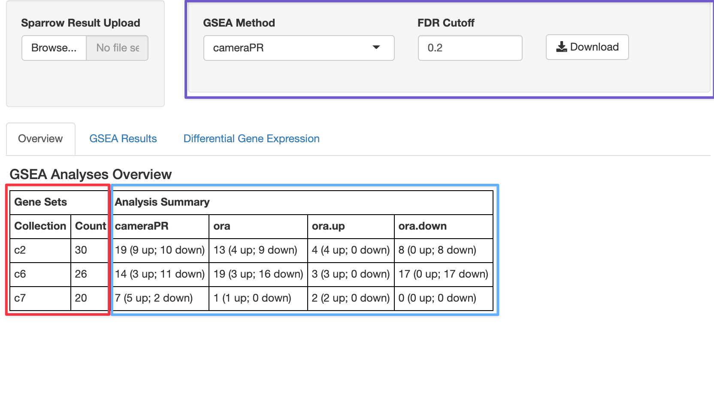
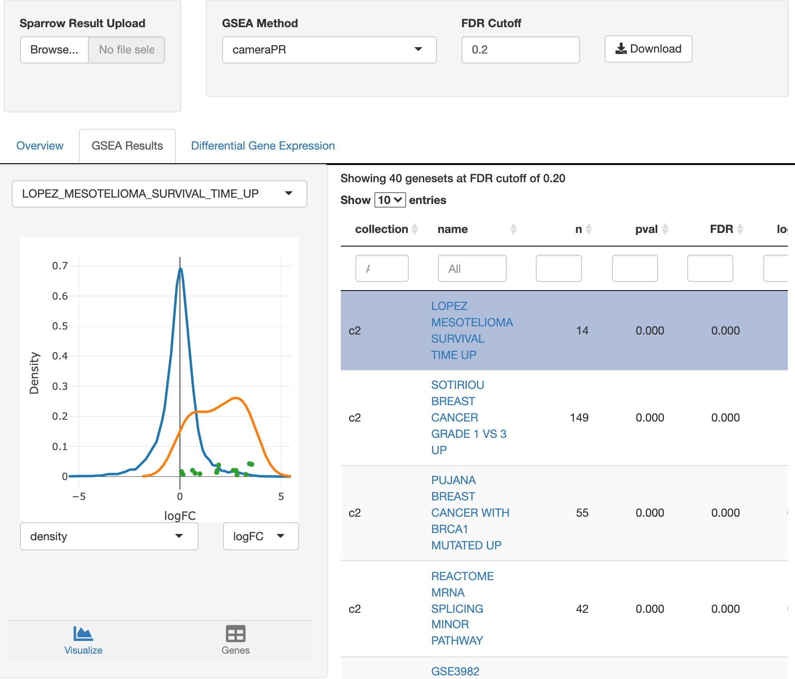

## Overview

This package provides a number of shiny modules we can use to interact with
a `SparrowResult` object we get from invoking `sparrow::seas()`.

We also provide a shiny app that combines these modules together for interactive
exploration which can be launched via the `explore()` method. We'll go over
the functionality of the app here.

## Setup

We'll perform a GSEA analysis using the `limma::cameraPR()` and an
overrepresentaiton analysis (goseq-like test) via `sparrow::ora` using an
example expression dataset from the sparrow package, which was taken from
a subset of samples from the TCGA/BRCA indication.

```{r, message=FALSE, warning=FALSE}
library(sparrow)
library(sparrow.shiny)
library(dplyr)
vm <- exampleExpressionSet(do.voom = TRUE)
```

We'll also use a subset of the C2, C6, and C7 MSigDB gene set collections,
which is also available as an example dataset in the sparrow package:

```{r}
gdb <- exampleGeneSetDb()
```

`gdb` contains the following number of genesets per collection:

```{r}
geneSets(gdb) %>% 
  count(collection)
```

And finally, we'll run the `limm::cameraPR()` and `sparrow::ora()` enrichment
tests on the tumor vs normal comparion:

```{r}
sres <- seas(vm, gdb, c("cameraPR", "ora"), vm$design, "tumor")
```

You can launch the shiny app included here to explore the `seas` results via
the `sparrow.shiny::explore()` function.

```{r eval=FALSE}
explore(sres)
```

When you do that, you will be greeted with a tabbed interface with the following
tabs outlined below.

## Overview


The control widgets in the top right box, outlined in purple, allow the user to
filter which geneset results to view by only showing those genesets that have
an FDR cutoff of less than 20% under the cameraPR analysis.

The table at the bottom that is highlighted with red and blue boxes gives you
an overview of your GSEA hits from at the 20% cutoff. The numbers in
the red box recapitulate the same output we calculated above, which tells us
the number of genesets *per collection* we ran our analysis against (30 c2
gene sets, 26 c6, and 20 c7). The blue-highlighted portion of the table tells
us the number of genesets per collection that satisfy the 20% FDR cutoff
for each of the GSEA methods we ran: cameraPR or ora.

We can see that at an FDR of 20%, 19 gene sets in the c2 collection were
significant, and nine of those gene sets are going up, whiel ten are going down.

Although we only ran one "ora" (over representation analysis), it is by default
run in three ways:

1. `ora`: pathway enrichment results from taking all up and down DGE genes.
2. `ora.up`: pathway enrichment analysis using only up regulated genes.
3. `ora.down`: pathway enrichment analysis using only down regulated genes.

## GSEA Results


The genesets that are signifcant via a cameraPR analysis at an FDR cutoff less
than 20% are listed on the table on the right. Clicking on the different
rows of the table will select it for view, updating the `geneSetContrastView`
module on the left.

### The geneSetContrastView Module

Provides a graphical view of the result, a tabular view which lists all of the
genes in the geneset as well as their individual differential expression
statistics, and the ability to select genes in the geneset to see *what other*
gene sets they are also a part of.
